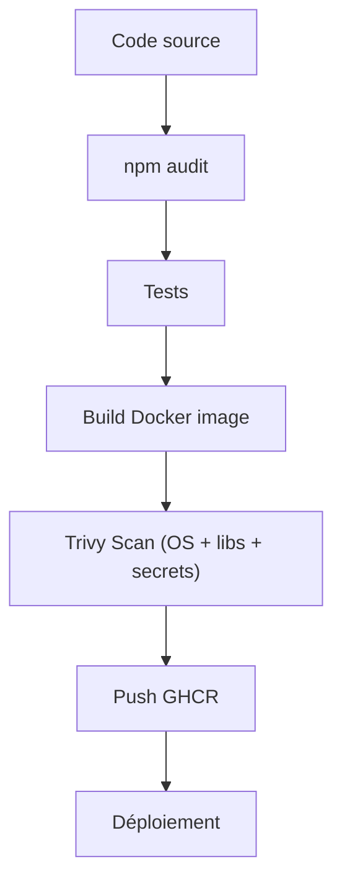

# 🛡️ SecPipelines — CI/CD Sécurisé pour Applications Node.js


> Un pipeline **DevSecOps complet** intégrant la sécurité dès la phase de build.  
> Basé sur **Docker**, **Trivy**, **npm audit**, et **GitHub Actions**.

---

## 🚀 Objectif

Ce projet démontre la mise en place d’un **pipeline CI/CD sécurisé** pour une application **Node.js** :
- 📦 Construction d’une image Docker minimaliste et durcie
- 🔍 Scan automatique des vulnérabilités système et applicatives
- 🧰 Vérification des dépendances NPM vulnérables
- ☁️ Publication de l’image sécurisée sur **GitHub Container Registry (GHCR)**

---

## ⚙️ Stack technique

| Composant | Rôle |
|------------|------|
| **Node.js 25 (Alpine 3.21)** | Base légère pour exécuter l’application |
| **npm audit** | Analyse de sécurité des dépendances Node.js |
| **Trivy** | Scan des vulnérabilités (OS + dépendances + secrets) |
| **Docker** | Conteneurisation et durcissement de l’environnement |
| **GitHub Actions** | Automatisation du pipeline CI/CD |
| **GitHub Container Registry (GHCR)** | Stockage et distribution des images Docker sécurisées |

---

## 📂 Structure du projet

```plaintext
📦 secpipelines/
┣ 📁 src/
┃ ┗ 📜 app.js # Application Node.js (Express ou autre)
┣ 📜 Dockerfile # Image multi-stage (build + production)
┣ 📜 package.json # Dépendances applicatives
┣ 📜 .trivyignore.yaml # Vulnérabilités ignorées (fausses alertes)
┣ 📜 .github/workflows/ci.yml # Pipeline CI/CD complet
┗ 📜 README.md
```

---

## 🧱 Dockerfile

L’image est construite en **deux étapes** pour garantir légèreté et sécurité :

```dockerfile
# -----------------------------
# 🏗️ Build stage
# -----------------------------
FROM node:25-alpine3.21 AS builder
WORKDIR /app

COPY . .
RUN npm install -g npm@latest && rm -f package-lock.json && npm install --omit=dev

# -----------------------------
# 🚀 Production stage
# -----------------------------
FROM node:25-alpine3.21
WORKDIR /app
ENV NODE_ENV=production

COPY --from=builder /app /app
EXPOSE 3000

CMD ["node", "src/app.js"]
```

# Avantages :

- Aucune dépendance de développement dans l’image finale

- Taille réduite

- Base Alpine → surface d’attaque minimale

# Analyse de sécurité (Trivy)
Le scan est exécuté automatiquement dans le pipeline CI :

Schéma simplifié :



---

🧩 Résultats observés
✅ Aucune vulnérabilité critique dans l’image finale
✅ Base Alpine sécurisée
✅ CI/CD automatisé et reproductible
✅ Compatible avec déploiement Docker / Kubernetes

# .trivyignore
+CVE-2025-64118

# Licence
Ce projet est distribué sous licence MIT — libre d’utilisation et de modification.

# 👨‍💻Auteur
Naguib Med
🧠 Master 2 OPSIE – Cybersécurité & DevSecOps
🌐 naguib.me
💼 LinkedIn

“Automatiser la sécurité, c’est accélérer la confiance.”


